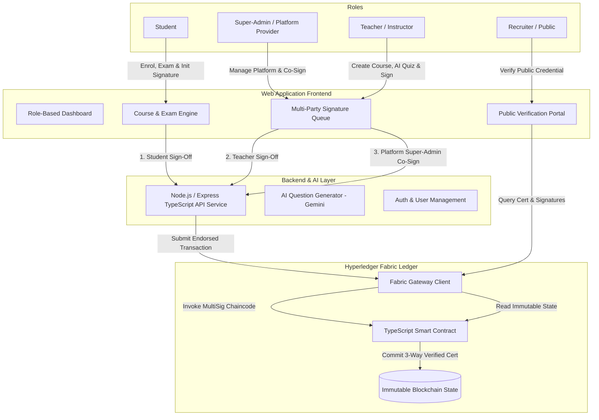
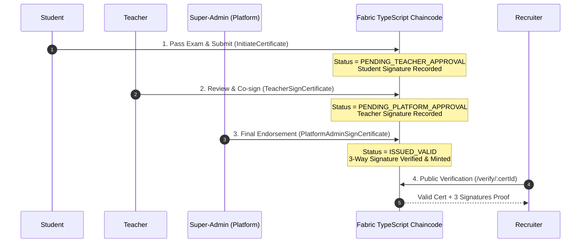

# Specification & Implementation Plan: Secured Blockchain Certification System (Hyperledger Fabric)

## Overview & Goal
The objective is to design and build a **secured, multi-party signed ledger system for storing course certifications using Hyperledger Fabric**. 

The solution consists of:
1. **Full-stack Web Application**: Multi-role portal for Super-Admins (Platform Provider e.g. edX/Coursera), Teachers, and Students.
2. **AI Question Generator**: Built-in feature allowing Teachers to generate 5-question multiple choice quizzes based on course text using Gemini AI.
3. **Hyperledger Fabric Smart Contract (TypeScript Chaincode)**: Immutably records completed certifications, student metadata, multi-party cryptographic signature approvals, and issuing timestamps.
4. **Multi-Party Consensus/Signature Agreement**: Certifications require 3-way multi-party signatures: **Student (completion)** + **Teacher (academic sign-off)** + **Super-Admin (Platform Provider sign-off)** before final ledger minting.
5. **AWS EC2 Deployability**: Containerized deployment setup (`docker-compose.yml` & deployment script) ready for AWS EC2 instances.
6. **Public Recruiter Verification Page**: Shareable credential links where external recruiters can verify certificate authenticity and 3-way multi-party signatures directly against the blockchain ledger.

---

## 1. Core Architecture & System Roles



### Role Breakdown

#### 👤 Super-Admin (Platform Provider e.g., edX / Coursera)
- **Platform Governance**: Manage institutions, teachers, and system-wide configurations.
- **Co-Signer / Issuing Authority**: Review pending student certificates and execute the final Platform Signature required by the Fabric Smart Contract.
- **Blockchain Network Telemetry**: View live block explorer, transaction telemetry, and chaincode health.

#### 👩‍🏫 Teacher / Instructor
- **Course & AI Exam Creator**: Create courses (with 1-page reading text) and use AI to generate 5 multiple-choice questions.
- **Academic Co-Signer**: Review student exam completions and apply the Teacher Signature to endorse certification.

#### 🎓 Student
- **Learning & Assessment**: Browse catalog, study course text, and take the 5-question exam (80%+ passing score).
- **Exam Sign-off**: Upon passing, digitally sign the completion proof to initiate the multi-party certificate pipeline.
- **My Credentials**: Access earned multi-signed credentials, copy shareable public verification links, or download PDF badges.

#### 🔍 Public Recruiter / Verifier (No Login Required)
- **Public Verification Portal**: Accessible via `/verify/:certificateId`.
- **Multi-Party Signature Audit**: Displays Student Name, Course Title, Issue Date, Final Score, SHA-256 Proof, and the 3 distinct cryptographic signatures (**Student** + **Teacher** + **Platform Provider**).

---

## 2. Hyperledger Fabric TypeScript Smart Contract Specification

The chaincode will be written in **TypeScript** using `@hyperledger/fabric-contract-api`.

### Ledger State Schema: `Certificate`
```json
{
  "docType": "certificate",
  "certificateId": "CERT-2026-98421",
  "studentId": "STD-1002",
  "studentName": "Alex Rivera",
  "courseId": "CRS-401",
  "courseTitle": "Introduction to Smart Contract Security",
  "teacherId": "TCH-301",
  "teacherName": "Dr. Sarah Chen",
  "platformId": "EDX-PLATFORM-MAIN",
  "score": 100,
  "issueTimestamp": "2026-10-06T08:00:00Z",
  "completionHash": "0xa4f8b9e... (SHA256 of exam submission)",
  "signatures": {
    "student": {
      "signed": true,
      "signedAt": "2026-10-06T08:01:00Z",
      "signatureHash": "sig_student_0x8f12..."
    },
    "teacher": {
      "signed": true,
      "signedAt": "2026-10-06T08:03:00Z",
      "signatureHash": "sig_teacher_0x3a91..."
    },
    "platformAdmin": {
      "signed": true,
      "signedAt": "2026-10-06T08:05:00Z",
      "signatureHash": "sig_platform_0x7c44..."
    }
  },
  "status": "ISSUED_VALID", // Transitions: DRAFT -> PENDING_TEACHER -> PENDING_PLATFORM -> ISSUED_VALID
  "revoked": false
}
```

### TypeScript Chaincode Methods
1. `InitLedger(ctx)`: Populates mock seed data for testing.
2. `InitiateCertificate(ctx, certId, studentId, studentName, courseId, courseTitle, score, completionHash)`: Student passes exam and creates draft cert with `student.signed = true` (Status: `PENDING_TEACHER_APPROVAL`).
3. `TeacherSignCertificate(ctx, certId, teacherId, teacherName)`: Teacher verifies & co-signs certificate (Status: `PENDING_PLATFORM_APPROVAL`).
4. `PlatformAdminSignCertificate(ctx, certId, platformAdminId)`: Platform Super-Admin co-signs. Validates that both Student and Teacher signatures exist before committing asset status as `ISSUED_VALID`.
5. `VerifyCertificate(ctx, certId)`: Returns full certificate record + multi-party signature validation status.
6. `GetCertificateHistory(ctx, certId)`: Returns full block-by-block immutable history detailing every signature event.

---

## 3. Technology Stack & AWS EC2 Deployment

| Component | Technology | Description |
| :--- | :--- | :--- |
| **Language** | **TypeScript** | Type-safe backend, smart contract, and frontend code. |
| **Frontend UI** | React / Vite + Tailwind CSS | Sleek dark/glassmorphic interface with live signature progress steppers. |
| **Backend API** | Node.js + Express + TypeScript | REST API managing auth, AI questions, and Fabric Gateway. |
| **AI Generator** | Google Gemini API (`@google/genai`) | AI-generated 5-question quizzes from course text. |
| **Smart Contract** | Fabric Node.js/TypeScript Chaincode | Immutably tracks 3-party signatures & certificate lifecycle. |
| **AWS EC2 Readiness** | Docker Compose (`docker-compose.yml`) | Single-command deployment on AWS EC2 (`docker compose up --build`). |

---

## 4. Multi-Party Signature Workflow Summary



---

## 5. Proposed Implementation Steps

### Step 1: Project Scaffolding in `/home/gvmuthu/code/Blockchain`
- Set up TypeScript monorepo / multi-package project (Chaincode, Backend, Frontend).
- Configure `docker-compose.yml` for AWS EC2 readiness.

### Step 2: Backend API & AI Quiz Engine
- Express TypeScript API with JWT Auth (Roles: `SUPER_ADMIN`, `TEACHER`, `STUDENT`).
- Gemini AI integration for generating 5 multiple-choice questions from 1-page text.

### Step 3: Hyperledger Fabric TypeScript Chaincode & MultiSig Ledger Engine
- Implement TypeScript Smart Contract with `InitiateCertificate`, `TeacherSignCertificate`, and `PlatformAdminSignCertificate`.
- Fabric Gateway integration with dual-mode support (Native Fabric SDK + standalone Fabric simulator).

### Step 4: Premium Frontend UI (React + Tailwind)
- Role-specific dashboards (Super-Admin, Teacher, Student).
- Interactive 5-question exam component.
- **Signature Progress Stepper UI** showing real-time 3-way approval status.
- **Public Recruiter Verification Page** with QR code, share link, signature audit modal, and print option.

### Step 5: AWS EC2 Scripting & Verification
- Create `deploy-ec2.sh` helper script.
- Execute end-to-end automated test suite verifying all 3 party signatures and public lookup.

---

## Verification Plan

### Automated Tests
- TypeScript chaincode unit tests for multi-signature state transitions (`PENDING_TEACHER` -> `PENDING_PLATFORM` -> `ISSUED_VALID`).
- API test suite validating student exam submissions and teacher/admin signing actions.

### Manual Verification
- Visual walk-through of 3-party approval flow (Student exam -> Teacher queue -> Platform Super-Admin queue -> Recruiter verify page).
